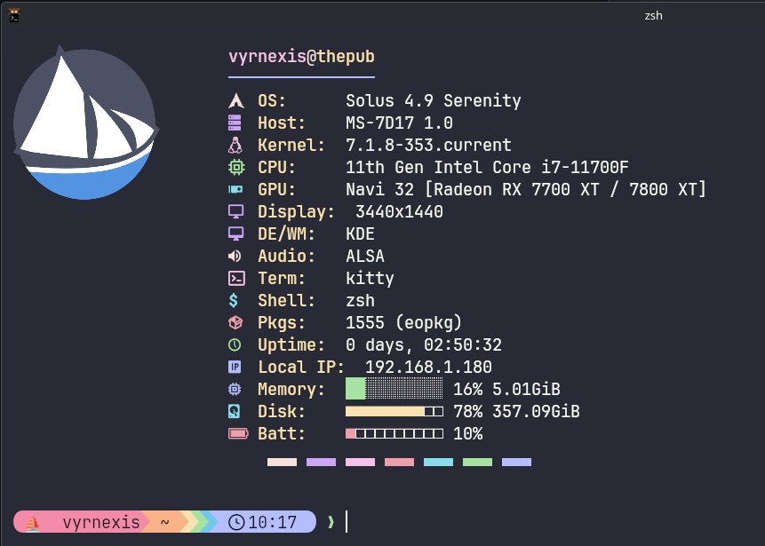

# Nymph

Nymph is a fast, lightweight terminal fetch tool written in Nim. It supports displaying PNG logos directly in your terminal using the Kitty graphics protocol, falling back to ASCII art if your terminal doesn't support images.



## Features

- **Fast:** Minimal dependencies and instant startup.
- **Image support:** Renders high-res PNGs in Kitty, WezTerm, Ghostty, etc.
- **Customizable:** Built-in themes (Catppuccin, Nord, Gruvbox), Nerd Font support, and tweakable layouts.
- **JSON mode:** Pipe system data into status bars (Waybar, Polybar) easily.

## Installation

You'll need Nim `>= 2.0.0` installed.

```bash
# Build the release binary to ./bin/nymph
nimble release

# Or run directly from source
nim c -r src/nymph.nim
```

## Quick Start

Run with defaults:
```bash
./bin/nymph
```

Override theme and layout without editing the config:
```bash
./bin/nymph --theme nord --icon-pack ascii --layout compact
```

Show only specific modules:
```bash
./bin/nymph --modules os,kernel,packages,memory
```

See all options and available themes from the terminal:
```bash
./bin/nymph --help
./bin/nymph --list-themes
./bin/nymph --list-icon-packs
```

## Configuration

On the first run, Nymph generates an INI-style config file at `~/.config/nymph/config.conf`. 

```conf
# Drop your own logo path here
customlogo = ""

# Layout & Themes
theme = catppuccin
iconpack = nerd
layout = full
json = false
nocolor = false

# Modules to display (must be wrapped in quotes)
modules = "os,kernel,desktop,packages,shell,uptime,memory,colours"

# Customize the colored blocks at the bottom of the fetch (leave empty for random)
footericons = ""
footerpadding = 7

# Advanced tweaks
maxwidth = 200
statsoffset = 22
```

### Footer Icons (`colours` module)
You can customize the colored footer. Pass a single icon (like `footericons = "▃▃▃"`) to repeat it, or a comma-separated list of symbols to cycle through them. Use `footerpadding` to align the block left or right relative to your stats.

## Available Modules
- `os`, `kernel`, `desktop` (DE/WM), `shell`, `uptime`
- `packages`: Counts packages across pacman, dpkg, flatpak, apk, snap, portage, eopkg, xbps, homebrew.
- `memory`: RAM usage with a compact visual bar.
- `colours`: Colored footer blocks.

## Scripting (JSON)
Need raw data for a script? Run `./bin/nymph --json` to get a clean JSON object containing all system metrics.

## Diagnostics
If your logo isn't loading or something looks wrong, run `./bin/nymph --doctor` to see exactly where Nymph is looking for files and whether it detected graphics support.

## Contributing
This is a hobby project! There might be edge cases on untested distros. Feel free to open a PR or issue. 

License: MIT. See [LICENSE](LICENSE).
